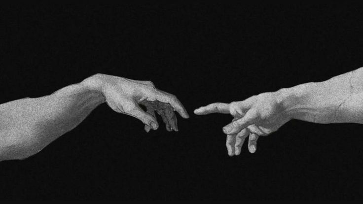
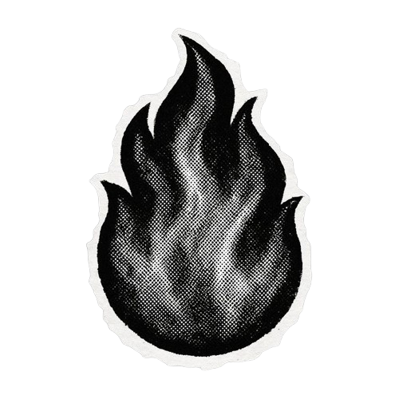

  

 

<h2 align="center">Know About Me</h2>

 

<table>
  <tr>
    <td width="300" align="center" valign="middle">
      
    </td>
    <td width="700" valign="middle">
      <h3>Hey there! I'm Araz Omarov 👋</h3>
      

        I'm a 15-year-old developer and Linux user who is passionate about technology, systems, and software engineering.
      

      

        <b>What I do & know:</b> I have knowledge in Frontend development and Python, and I am currently navigating my journey in IT. 
        <b>My main goal:</b> I'm actively learning Backend development along with C/C++ with the ultimate goal of building my own Operating System (OS).
      

    </td>
  </tr>
</table>

 

 

<table>
  <tr>
    <td width="700" valign="middle">
      <h3>Top Projects & Goals 🚀</h3>
       
      

        
         
        Desktop GUI calculator application written with Python's Tkinter library.
      

       
      

        
         
        My personal portfolio website showcasing my journey, skills, and projects.
      

       
      

        
         
        Responsive web interfaces, landing pages, and ongoing frontend projects.
      

    </td>
    <td width="300" align="center" valign="middle">
      
    </td>
  </tr>
</table>

 

<h2 align="center">Connect</h2>

 

  
  &nbsp;
  
  &nbsp;
  

 

<blockquote>
  
Code is never finished. It only becomes slightly less terrible over time.

  
Every commit I make is essentially just a small, desperate apology to my future self. Someday I will return to this codebase, look at the spaghetti I've written, and wonder who let me anywhere near a keyboard.

</blockquote>
